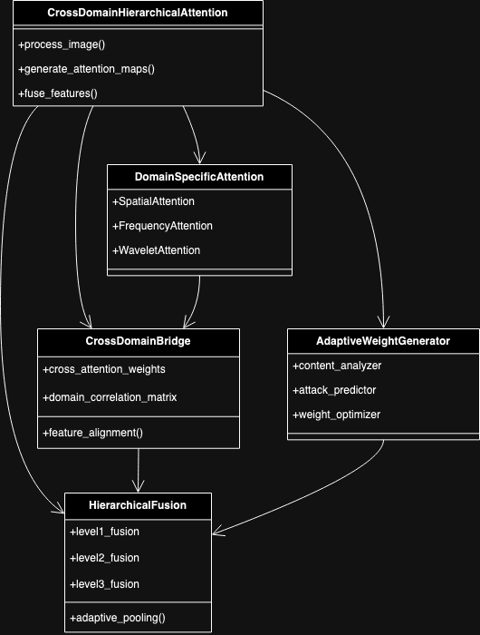

# CDHA Algorithm

## Architecture design for the Cross Domain Hierarchical Attention (CDHA) 

**1. Domain-Specific Attention (DSA):**
   - Spatial Attention:
     - Uses convolutional self-attention to capture local spatial relationships
     - Multi-head attention for different spatial feature aspects
     - Position-aware encoding for spatial context
   
   - Frequency Attention:
     - DCT-domain attention for frequency components
     - Adaptive frequency band weighting
     - Phase-aware attention mechanisms
   
   - Wavelet Attention:
     - Multi-scale wavelet coefficient attention
     - Sub-band specific attention weights
     - Detail coefficient relationships learning

**2. Cross-Domain Bridge (CDB):**
   - Feature Alignment:
     - Domain-specific feature normalization
     - Cross-domain feature mapping
     - Attention space alignment
   
   - Domain Correlation:
     - Inter-domain relationship learning
     - Dynamic correlation matrix
     - Adaptive domain weighting
   
   - Feature Transfer:
     - Cross-domain information flow
     - Feature enhancement gates
     - Domain-specific feature augmentation

**3. Hierarchical Fusion (HF):**
   - Level 1 (Low-level Features):
     - Edge and texture attention
     - Basic shape attention
     - Color pattern attention
   
   - Level 2 (Mid-level Features):
     - Structure attention
     - Pattern attention
     - Region relationship attention
   
   - Level 3 (High-level Features):
     - Semantic attention
     - Content-based attention
     - Context attention

**4. Adaptive Weight Generator (AWG):**
   - Content Analysis:
     - Image complexity assessment
     - Content type classification
     - Region importance scoring
   
   - Attack Prediction:
     - Vulnerability assessment
     - Attack type prediction
     - Robustness scoring
   
   - Weight Optimization:
     - Dynamic weight adjustment
     - Multi-objective optimization
     - Feedback-based refinement

## Key Innovations:

**1. Multi-Scale Processing:**
   - Processes image at multiple scales simultaneously
   - Hierarchical feature extraction and fusion
   - Scale-adaptive attention weights

**2. Cross-Domain Learning:**
   - Learns relationships between domains
   - Adapts attention based on domain correlations
   - Unified attention space across domains

**3. Attack-Aware Adaptation:**
   - Predicts potential attacks
   - Adapts fingerprint strength accordingly
   - Dynamic robustness optimization

**4. Dynamic Weight Optimization:**
   - Content-aware weight adjustment
   - Attack-based weight modification
   - Feedback-based refinement

