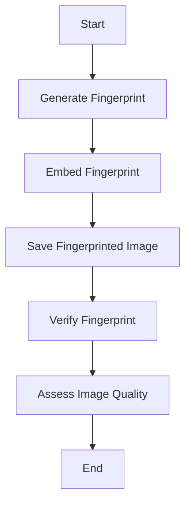
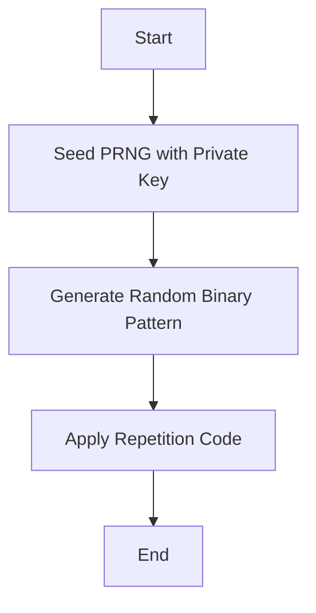
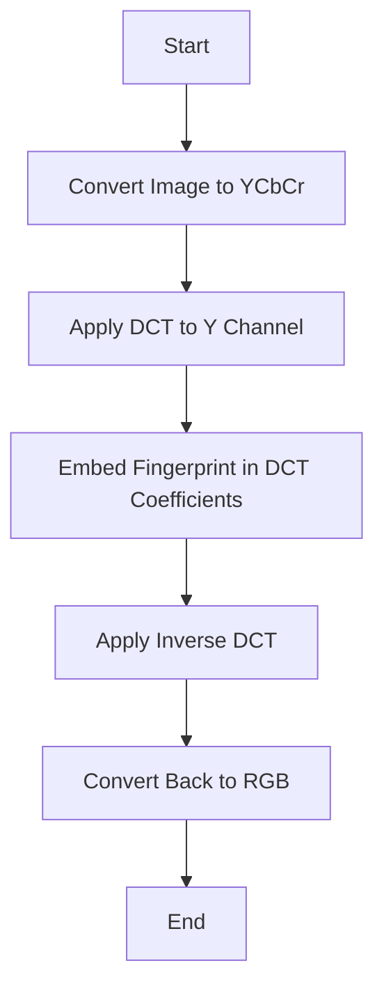
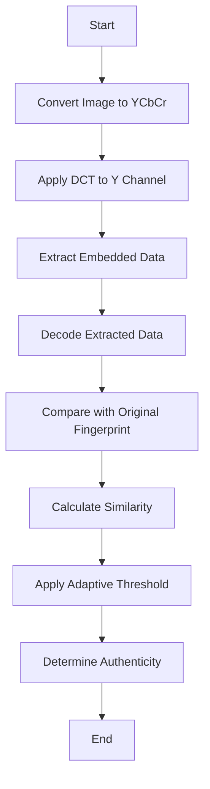
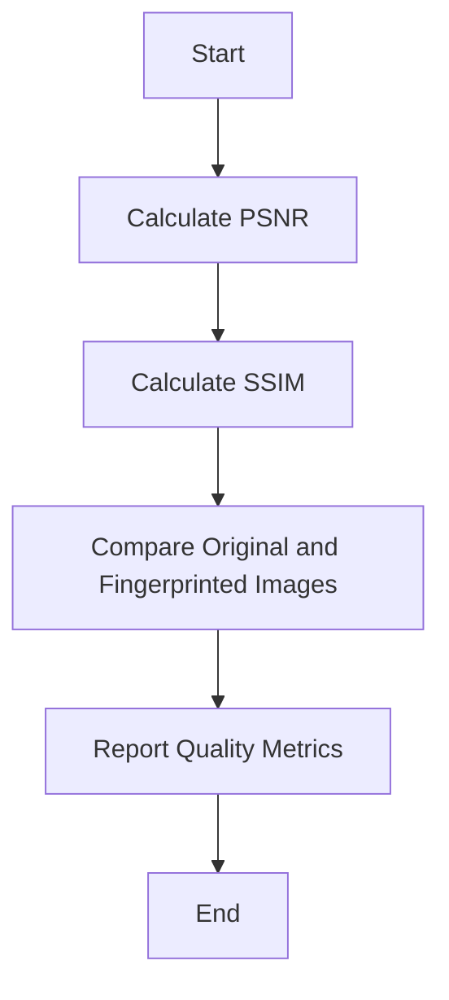

AlphaPunch
==========

## Overview
AlphaPunch algorithm uses a frequency domain approach for embedding and extracting fingerprints. 
This method is generally more robust against various image transformations compared to spatial domain techniques.

### Overall Process Flow



**Explanation:**
- We chose this overall flow because it separates the key processes: generation, embedding, verification, and quality assessment.
- This modular approach allows for easier testing and optimization of individual components.

### Fingerprint Generation

- Uses a cryptographically secure pseudo-random number generator (CSPRNG) seeded with a private key to generate a binary pattern.
- The pattern size should be smaller than the image dimensions (e.g., 64x64 for a 512x512 image).



**Explanation:**
- We use a private key to seed the PRNG for security.
- The repetition code (3x repetition) is used for error correction, improving robustness.
- This approach was chosen over more complex error correction codes for its simplicity and effectiveness.

### Fingerprint Embedding



**Explanation:**
- YCbCr color space is used because it separates luminance (Y) from chrominance (Cb, Cr), allowing us to focus on the Y channel for embedding.
- DCT (Discrete Cosine Transform) is chosen because:
  1. It's widely used in image compression, making the fingerprint robust against JPEG compression.
  2. It allows for embedding in mid-frequency coefficients, balancing imperceptibility and robustness.
- We embed in multiple positions for each bit to improve reliability.

### Fingerprint Verification



**Explanation:**
- The verification process mirrors the embedding process for consistency.
- Adaptive thresholding is used to account for variations in image quality and potential transformations.
- We chose to use similarity comparison over exact matching to allow for some level of data loss or modification.

### Image Quality Assessment



**Explanation:**
- PSNR (Peak Signal-to-Noise Ratio) is used as it's a standard metric for image quality.
- SSIM (Structural Similarity Index) is included because it better represents human perception of image quality.
- Both metrics are used to provide a comprehensive assessment of the fingerprinting impact.


### Key Design Decisions and Rationale:

1. **Use of DCT**:
   - Chosen for its robustness against compression and its ability to embed data in a way that's resistant to various image processing operations.
   - Alternative: Spatial domain embedding was considered but rejected due to lower robustness against common image transformations.

2. **YCbCr Color Space:**
   - Selected because it separates luminance from chrominance, allowing us to focus on the Y channel where changes are less perceptible.
   - Alternative: Embedding in RGB channels was considered but would be more visible and less robust.

3. **Repetition Code for Error Correction:**
   - Simple yet effective for improving robustness.
   - Alternative: More complex error correction codes (e.g., Reed-Solomon) were considered but deemed unnecessary for the current application and would increase computational complexity.

4. **Adaptive Thresholding:**
   - Allows for flexibility in verification, accounting for variations in image quality and potential transformations.
   - Alternative: Fixed thresholding would be simpler but less effective across diverse images and conditions.

5. **Multiple Embedding Positions:**
   - Improves reliability and robustness against localized image modifications.
   - Alternative: Single position embedding would be simpler but more vulnerable to data loss.

6. **Use of Private Key:**
   - Enhances security by making the fingerprint unique to each user.
   - Alternative: Fixed fingerprint pattern would be simpler but less secure.

AlphaPunch balances security, robustness, and image quality, making it suitable for various digital image authentication scenarios. 
The modular design allows for future enhancements and optimizations in specific components as needed.


## Improvements:

1. Robustness testing with various image transformations
2. Adaptive thresholding based on image quality
3. Image quality assessment using PSNR and SSIM
4. Enhanced security with AES encryption 
5. ~~Performance optimization using Numba's @jit decorator~~
6. A command-line interface for easy use
7. A simple GUI for user-friendly interaction


## AlphaPunch Usage

Run the program using one of these methods:

1. Install dependencies: ```pip install -r requirements.txt```
    ```text
        numpy==1.26.4
        Pillow==10.2.0
        scipy==1.12.0
        pycryptodome==3.20.0
        tqdm==4.66.2
        opencv-python==4.9.0.80
        scikit-image==0.22.0
        numba==0.59.0
        requests==2.31.0
    ```

2. Execution Modes:
- For GUI: `python run_alphapunch.py --gui`
- For command-line embedding: `python run_alphapunch.py --embed --input input.png --output output.png`
- For command-line verification: `python run_alphapunch.py --verify --input fingerprinted.png`
- For Unsplash: `python unsplash_tester.py --num_images 20`


## Sample Run (unsplash)
see samples runs in logs/ folder

```text
▶ python unsplash_tester.py --num_images 20                                                                                                                                                               
2024-10-16 00:52:48,100 - AlphaPunchTester - INFO - Downloading 20 random images from Unsplash...
2024-10-16 00:52:48,826 - AlphaPunchTester - INFO - Downloaded: rOYqWTQRT-k.jpg
2024-10-16 00:52:48,944 - AlphaPunchTester - INFO - Downloaded: IaPlDU14Oig.jpg
2024-10-16 00:52:49,095 - AlphaPunchTester - INFO - Downloaded: gpp6ryvpdhY.jpg
2024-10-16 00:52:49,207 - AlphaPunchTester - INFO - Downloaded: 7IVHheQ7i6U.jpg
2024-10-16 00:52:49,327 - AlphaPunchTester - INFO - Downloaded: 8AKNWVIwXPg.jpg
2024-10-16 00:52:49,465 - AlphaPunchTester - INFO - Downloaded: uxAkoaGz6bw.jpg
2024-10-16 00:52:49,598 - AlphaPunchTester - INFO - Downloaded: lPT68cErqrM.jpg
2024-10-16 00:52:49,712 - AlphaPunchTester - INFO - Downloaded: FTLOH8t6xzQ.jpg
2024-10-16 00:52:49,851 - AlphaPunchTester - INFO - Downloaded: JR_7ERoKAa4.jpg
2024-10-16 00:52:50,026 - AlphaPunchTester - INFO - Downloaded: YcY1M9sYYCw.jpg
2024-10-16 00:52:50,165 - AlphaPunchTester - INFO - Downloaded: c8Q2jukjyZo.jpg
2024-10-16 00:52:50,293 - AlphaPunchTester - INFO - Downloaded: 38OTHc-zU6c.jpg
2024-10-16 00:52:50,450 - AlphaPunchTester - INFO - Downloaded: qhaOy2xtrYE.jpg
2024-10-16 00:52:50,577 - AlphaPunchTester - INFO - Downloaded: LQKN0a59JkM.jpg
2024-10-16 00:52:50,688 - AlphaPunchTester - INFO - Downloaded: 8RCb32Zc2-Q.jpg
2024-10-16 00:52:50,803 - AlphaPunchTester - INFO - Downloaded: 0xMU1DExxrI.jpg
2024-10-16 00:52:50,908 - AlphaPunchTester - INFO - Downloaded: P0Wv8RI1mkM.jpg
2024-10-16 00:52:50,908 - AlphaPunchTester - INFO - Image oOVEiYTIYk8.jpg already exists. Skipping download.
2024-10-16 00:52:51,031 - AlphaPunchTester - INFO - Downloaded: wZ3yP0wQibk.jpg
2024-10-16 00:52:51,149 - AlphaPunchTester - INFO - Downloaded: 0nE-twABQ7c.jpg
2024-10-16 00:52:51,150 - AlphaPunchTester - INFO - Testing AlphaPunch on downloaded images...
Testing images:   0%|                                                                                                                                                                                                                                                                                                                                                                                          | 0/20 [00:00<?, ?it/s]2024-10-16 00:52:51,164 - AlphaPunchTester - INFO - Starting fingerprint embedding process...
2024-10-16 00:52:51,263 - AlphaPunchTester - INFO - Generating and encrypting fingerprint...
2024-10-16 00:52:51,264 - AlphaPunchTester - INFO - Embedding fingerprint in image blocks...
Embedding Progress: 100%|████████████████████████████████████████████████████████████████████████████████████████████████████████████████████████████████████████████████████████████████████████████████████████████████████████████████████████████████████████████████████████████████████████████████████████████████████████████████████████████████████████████████████████████████████| 24300/24300 [00:00<00:00, 44148.90it/s]
2024-10-16 00:52:52,200 - AlphaPunchTester - INFO - Applying embedded blocks to image...███████████████████████████████████████████████████████████████████████████████████████████████████████████████████████████████████████████████████████████████████████████████████████████████████████████████████████████████████████████████████████████████████████████████████████████████▌     | 23933/24300 [00:00<00:00, 39956.10it/s]
2024-10-16 00:52:52,280 - AlphaPunchTester - INFO - Saving fingerprinted image to fingerprinted_images/fp_rOYqWTQRT-k.jpg...
2024-10-16 00:52:52,787 - AlphaPunchTester - INFO - Fingerprint embedding complete.
Function embed_fingerprint took 1.6300 seconds to run.
2024-10-16 00:52:53,048 - AlphaPunchTester - INFO - Image Quality - PSNR: 51.19 dB, SSIM: 0.9979
2024-10-16 00:52:53,048 - AlphaPunchTester - INFO - Starting fingerprint verification process...
2024-10-16 00:52:53,162 - AlphaPunchTester - INFO - Extracting fingerprint from image blocks...
..
..
..
Function verify_fingerprint took 0.4250 seconds to run.
Testing images: 100%|█████████████████████████████████████████████████████████████████████████████████████████████████████████████████████████████████████████████████████████████████████████████████████████████████████████████████████████████████████████████████████████████████████████████████████████████████████████████████████████████████████████████████████████████████████████████████| 20/20 [00:43<00:00,  2.18s/it]
2024-10-16 00:53:34,775 - AlphaPunchTester - INFO - Generating report...
2024-10-16 00:53:34,776 - AlphaPunchTester - INFO - Report generated: alphapunch_report.json

Test Summary:
Total images tested: 20
Authentic images: 19 (95.00%)
Average PSNR: 51.30 dB
Average SSIM: 0.9968
Average Similarity: 95.02%

```